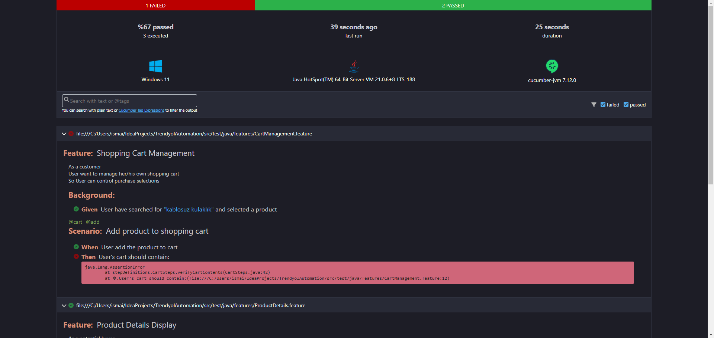
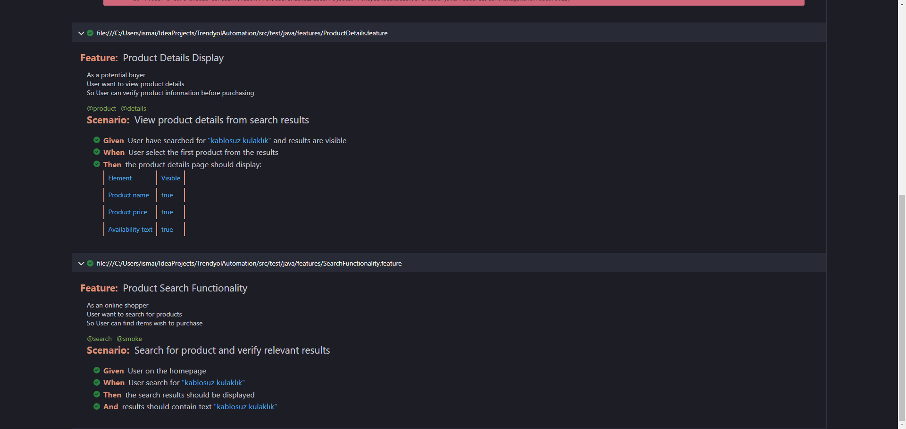

# Test Automation Framework for E-commerce

A Cucumber-Selenium test automation framework following Page Object Model (POM) best practices.

---

## Table of Contents

1. [Prerequisites](#prerequisites)
2. [Setup](#setup)
3. [Running Tests](#running-tests)
4. [Project Structure](#project-structure)
5. [Page Object Model](#page-object-model)

---

## Prerequisites

- **Java JDK 17+** ([Installation Guide](https://www.oracle.com/java/technologies/downloads/))
- **Maven 3.8.6+** ([Installation Guide](https://maven.apache.org/install.html))
- **Chrome Browser 100+** (or your target browser)
- **IDE** (IntelliJ recommended)

---

## Setup

1. **Clone the Repository**
   ```bash
   git clone https://github.com/yourusername/ecommerce-tests.git
   ```

---

## Running Tests

- You can open the project in IntelliJ.
- Then, run the _TestRunner.java_ to run test scenarios.

---

## Project Structure
```
src/
├── main/java/
│   └── pages/               # Page Object classes
│       ├── BasePage.java
│       ├── HomePage.java
│       └── ...
│
├── test/java/
│   ├── steps/               # Step definitions
│   │   ├── SearchSteps.java
│   │   └── ...
│   ├── runners/             # Test runners
│   │   └── TestRunner.java
│   └── utils/               # Utilities
│       └── Config.java
│
└── test/resources/
    ├── features/            # Gherkin feature files
    └── config.properties     # Configuration file
```

---

## Page Object Model

### BasePage
Centralizes common Selenium operations and waits.

### Page Classes
Each page (e.g., HomePage, CartPage) extends BasePage and defines element locators and page-specific actions.


---

## Reports
HTML reports generated in `target/cucumber-reports.html`



